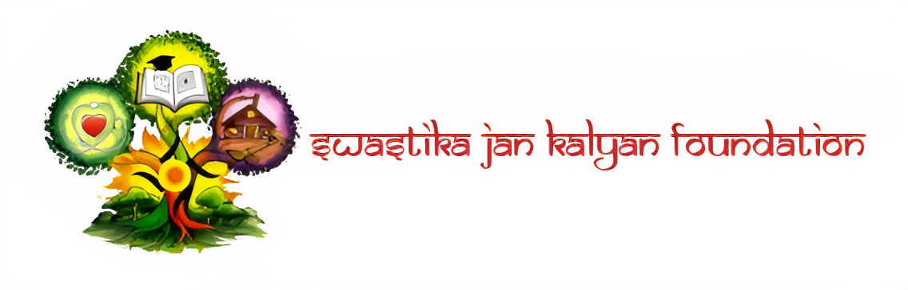

<div align="center">



# 🌿 Swastika Jan Kalyan Foundation

### *Protecting the environment. Empowering communities. Inspiring change.*

<br />


<br />

> ⚠️ **This website is currently under active development. Features and pages are being added progressively.**

</div>

---

## 📖 About

**Swastika Jan Kalyan Foundation (SJKF)** is a registered non-governmental organization committed to:

- 🌳 **Forestation & Reforestation** — Planting trees and restoring green cover
- 🌍 **Climate Action** — Driving awareness and grassroots climate initiatives
- ♻️ **Sustainable Development** — Promoting eco-friendly practices in communities
- 🏥 **Health & Sanitation** — Ensuring access to basic healthcare and hygiene
- 📚 **Education** — Empowering individuals through quality education programs

This repository contains the official website of Swastika Jan — built to share our mission, causes, and impact with the world.

---

## 🚧 Development Status

| Page / Feature | Status |
|---|---|
| 🏠 Hero / Home Section | ✅ Complete |
| 📜 Footer | ✅ Complete |
| 🙋 About Page | ✅ Complete  |
| 💚 Causes Page | 🔄 In Progress |
| 📝 Blog | 🔄 In Progress |
| 📬 Contact Page | ✅ Complete |
| 📱 Mobile Responsiveness | ✅ Complete |
| 🎨 Animations & Polish | ✅ Complete  |

---

## 🛠️ Tech Stack

| Technology | Purpose |
|---|---|
| [React 18](https://react.dev/) | UI Framework |
| [Tailwind CSS 3](https://tailwindcss.com/) | Styling |
| [Vite](https://vitejs.dev/) | Build Tool & Dev Server |
| Google Fonts (Sora + DM Sans) | Typography |

---

## 🚀 Getting Started

### Prerequisites
- Node.js `v18+`
- npm or yarn

### Installation

```bash
# Clone the repository
git clone https://github.com/gyan-js/swastika-jankalyan-foundation.git

# Navigate into the project
cd swastika-jankalyan-foundation

# Install dependencies
npm install

# Start the development server
npm run dev
```

The app will be running at `http://localhost:5173`

### Build for Production

```bash
npm run build
```

---

## 📁 Project Structure

```
swastika-jankalyan-foundation/
├── public/
├── src/
│   ├── assets/          # Images, logo, icons
│   ├── components/      # Reusable components
│   ├── App.css          # Global styles
│   ├── App.jsx          # Root component
│   ├── index.css        # Global styles(2.0)
│   └── main.jsx         # Entry point
├── index.html
├── tailwind.config.js
├── vite.config.js
├── package-lock.json
└── package.json
```

---

## 📬 Contact

**Swastika Jan Kalyan Foundation**
1st Floor, Opposite Durga Mandir, Lower Hatia,
Near Sunday Market, Hatia, Ranchi, Jharkhand, India — 834003

| | |
|---|---|
| 📧 Email | [swastikajankalyanfoundation@gmail.com](mailto:swastikajankalyanfoundation@gmail.com) |
| 📞 Phone | [+91 9229875702](tel:+919229875702) *(Mon–Fri, 9AM–5PM)* |
| 📸 Instagram | [@swastikajankalyanfoundation](https://www.instagram.com/swastikajankalyanfoundation) |
| 💼 LinkedIn | [Swastika Jan Kalyan Foundation](https://www.linkedin.com/company/swastikajankalyanfoundation/) |
| ⚓ Threads | [@swastikajankalyanfoundation](https://www.threads.com/@swastikajankalyanfoundation) |

---

## 🤝 Contributing

This is an NGO project built with ❤️ for the community. Contributions, suggestions, and feedback are welcome.

1. Fork the repository
2. Create your branch: `git checkout -b feature/your-feature`
3. Commit your changes: `git commit -m 'Add your feature'`
4. Push to the branch: `git push origin feature/your-feature`
5. Open a Pull Request

---

## 📄 License

This project is licensed under the [MIT License](LICENSE).

---

<div align="center">

Made with 💚 for the planet and its people

**Swastika Jan Kalyan Foundation** · Ranchi, Jharkhand, India


© 2026 Swastika Jan Kalyan Foundation. All rights reserved.
</div>

</div>

